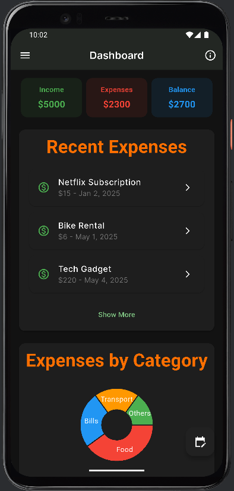
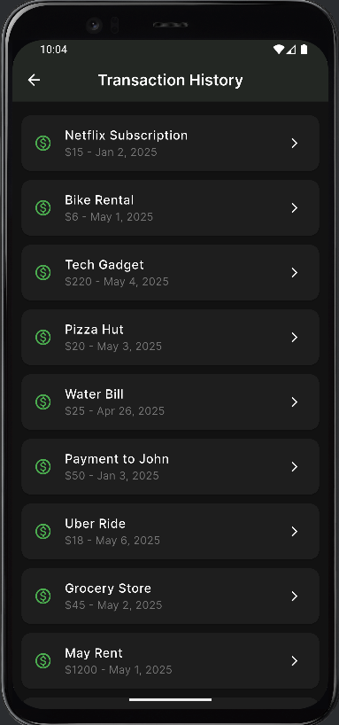
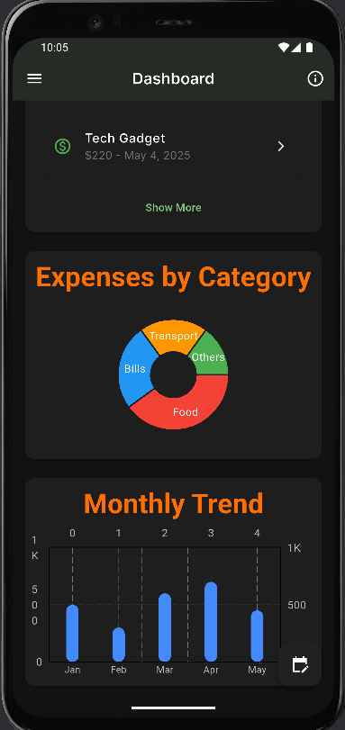

# 💰 Expense Manager App

The Expense Manager is a user-friendly mobile app designed to help individuals track and manage their finances with ease. The app provides a sleek dark UI, giving users insights into their spending habits through graphs and categorized data.

## 📱 Features

- **Dashboard Overview**:
  - Income, Expenses, and Balance summary
  - Recent expenses list
- **Transaction History**:
  - Detailed log of all expenses with category, date, and amount
- **Visualization**:
  - Pie chart for "Expenses by Category"
  - Bar chart for "Monthly Expense Trend"
- **Dark Mode UI**:
  - Eye-friendly design with vibrant category colors

## 🧩 Screenshots

| Dashboard | Transaction History | Charts View |
|----------|---------------------|--------------|
|  |  |  |

## 🔧 Technologies Used

- Flutter (UI & App Logic)
- Dart (Programming Language)


## 🚀 Getting Started

1. **Clone the repo**
   ```bash
   git clone https://github.com/your-username/expense-manager.git
   cd expense-manager
